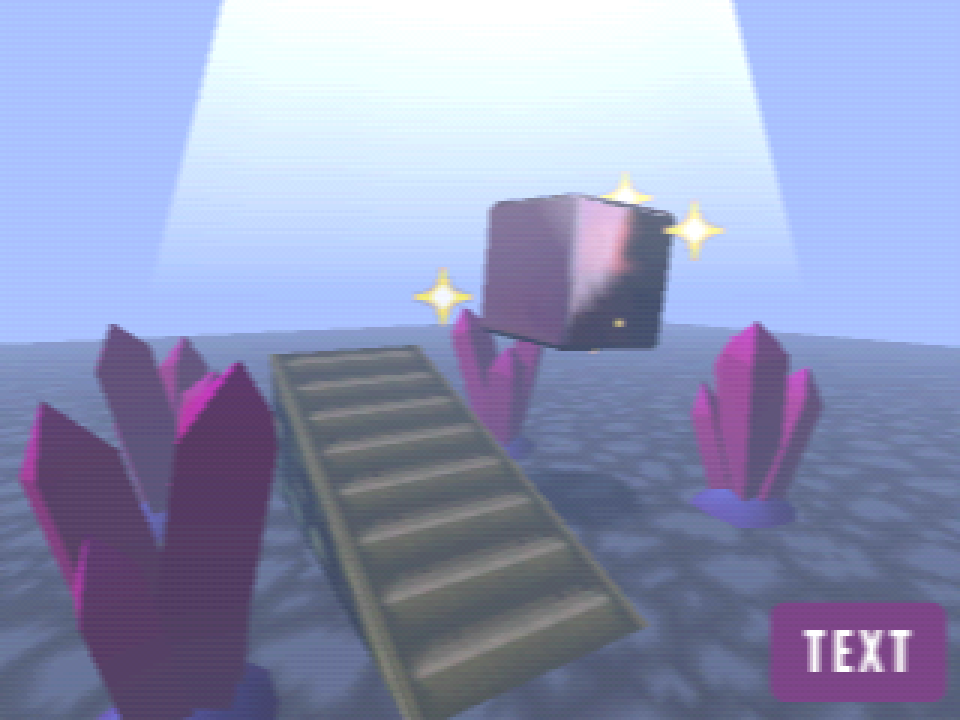

# Godot N64 Style Demo

[Play demo in browser!](https://menacingmecha.itch.io/godot-n64-shader-demo)

A collection of shaders and materials for Godot engine that aim to recreate the aesthetics and quirks of the N64

## Features

- 3-point texture filtering
- Light anti-aliasing
- Linear mip-map filtering
- Horizontal blur across the screen
- Limited color depth
- Hardware dithering to hide color banding
- Shiny chrome-like metallic surfaces
- Billboard sprites
- Fog to limit draw distance

## Demo Controls

- Space: Toggle camera and object movement
- R: Reset scene

## Tips for best results

- Use very low poly models
    - Prefer smooth-shading over flat-shading wherever possible
- Keep textures as low resolution as humanly possible
    - Huge blurry texels are the cornerstone of the N64 look
    - Rely on a mix of vertex colours and texture maps, instead of higher detailed texture maps wherever possible
- Keep your internal resolution low
    - Resolution on N64 is a complicated affair. While the system would output to video at certain specific resolutions, games themselves would have their own separate internal resolutions
    - These internal resolutions could vary wildly between games, but 320x240 seems to be the most common choice
    - That being said, you can easily go widescreen by using a 16:9 resolution with similar height
- Use as basic of a lighting set up as you can get away with
    - Modern lighting techniques are a very easy way to break the illusion of appearing like early 3D!
    - Where possible, prefer to use white ambient light, with vertex colours on geometry to fake lighting
- Prefer additive blending to transparent blending

## Changes from v1.x

### Major version change
This version is for Godot 4.x only.
Please refer to the v1.x branch for Godot 3.x support.

### Fog

Godot 4.0 changed how environmental fog worked, the key part being the removal of the "start distance" and "end distance" properties.
While a manual workaround could be implemented, there is work being done to restore this functionality in a later version.

### Runtime options

In order to release working Godot 4 shaders as soon as possible, runtime options for the demo will be re-implemented at a later date.

## Credits

Floor texture (available under CC-0): https://stealthix.itch.io/rpg-nature-tileset
